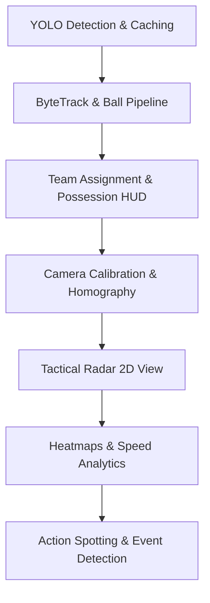

# Detect-Football: Hệ thống Phân tích Trận đấu Bóng đá Tự động

Hệ thống phân tích video bóng đá tự động dựa trên Trí tuệ nhân tạo và Thị giác máy tính. Dự án tích hợp các công nghệ nhận diện vật thể tiên tiến, thuật toán theo dõi quỹ đạo, phân cụm học máy không giám sát để phân tích đội hình, vẽ đường di chuyển của bóng và tính toán tỷ lệ kiểm soát bóng (Possession) theo thời gian thực.

---

## 🎥 Video Kết Quả Demo (Result Demo)

Dưới đây là video demo kết quả xử lý của pipeline (bao gồm khoanh vùng màu elip theo đội, vẽ tam giác chỉ thị bóng kèm đuôi chuyển động chuyển màu, và bảng HUD hiển thị tỷ lệ kiểm soát bóng Possession trực quan ở mép trên khung hình):

https://github.com/caoban123/Detect-Football/raw/main/outputs/output_tracked.mp4

---

## 📌 Các Tính Năng Cốt Lõi

*   **Nhận diện & Theo dõi Đa mục tiêu (Multi-Object Tracking):** Nhận diện cầu thủ, thủ môn, trọng tài và quả bóng bằng mô hình YOLO tinh chỉnh. Theo dõi định danh (ID) người chơi bằng thuật toán **ByteTrack** tối ưu hóa.
*   **Tự động Phân chia Đội hình (Team Assignment):** Trích xuất vùng áo đấu (torso), sử dụng mô hình **SigLIP** (Google) để lấy đặc trưng hình ảnh, giảm chiều dữ liệu bằng **UMAP** và phân cụm tự động thành 2 đội bằng **KMeans**. Không cần cấu hình ngưỡng màu thủ công.
*   **Xử lý Quỹ đạo Bóng 3 lượt (3-Pass Ball Tracking Pipeline):**
    *   *Lượt 1 (Quét thô):* Lọc bóng bằng Rolling Centroid kết hợp ngưỡng thích ứng kích thước.
    *   *Lượt 2 (Nội suy):* Tự động bù đắp các khoảng mất dấu bóng (dưới 15 frames) bằng nội suy tuyến tính.
    *   *Lượt 3 (Làm mượt):* Áp dụng Exponential Moving Average (EMA) và vẽ đuôi chuyển động chuyển màu.
*   **Tính toán Kiểm soát Bóng (Ball Possession HUD):** Tính toán khoảng cách hình học thích ứng từ bóng đến chân cầu thủ/thủ môn. Áp dụng cơ chế duy trì sở hữu tạm thời (*last-touch hysteresis*) khi bóng bay tự do, hiển thị biểu đồ HUD trực quan trên video và xuất dữ liệu chi tiết ra tệp JSON.
*   **Tối ưu hóa Cache Detections:** Chỉ chạy suy luận YOLO một lần duy nhất cho toàn bộ video và lưu kết quả vào RAM, giúp tăng gấp đôi tốc độ xử lý trên CPU/GPU.

---

## 📖 Nguồn Học Tập & Cảm Hứng (References & Credits)

Dự án được nghiên cứu và phát triển dựa trên các nguồn tư liệu chuyên sâu:
1.  **Roboflow Sports / Roboflow Soccer Analytics:** Tham khảo pipeline cấu trúc xử lý video bóng đá chuyên nghiệp từ Roboflow Sports, đặc biệt là cách phân phối ByteTrack cho người chơi và xử lý lớp màu sắc áo đấu.
2.  **YOLOv8 / YOLOv11 (Ultralytics):** Sử dụng thư viện Ultralytics để huấn luyện và suy luận mô hình nhận diện vật thể với tốc độ cao.
3.  **Supervision (Roboflow):** Sử dụng các annotator cao cấp như `EllipseAnnotator`, `TriangleAnnotator` để vẽ các marker lên khung hình mượt mà.
4.  **Google SigLIP (Vision-Language Model):** Tham khảo kiến trúc mô hình học sâu đại diện hình ảnh đa phương thức SigLIP (`google/siglip-base-patch16-224`) thay thế cho CLIP truyền thống, giúp trích xuất màu sắc và họa tiết áo đấu vượt trội hơn.
5.  **UMAP & Scikit-learn:** Phương pháp giảm chiều dữ liệu giữ nguyên cấu trúc topo cục bộ (UMAP) kết hợp phân cụm khoảng cách KMeans được ứng dụng để phân cụm áo đấu tự động không giám sát.

---

## 🔬 Mô Tả Chi Tiết Các Kỹ Thuật Đã Áp Dụng (Technical Deep-Dive)

### 1. Nhận diện vật thể bằng YOLO Custom & Tối ưu hóa Cache Detections
*   **Nhận diện (Object Detection):** Pipeline hỗ trợ tải các trọng số tinh chỉnh (ví dụ `models/best.pt`) của YOLOv8 hoặc YOLOv11. Các nhãn lớp tự động được ánh xạ dựa trên tên lớp trong tệp trọng số (như `player`, `ball`, `goalkeeper`, `referee`).
*   **Ngưỡng nhạy bóng:** Để tránh mất dấu quả bóng bóng siêu nhỏ, hệ thống sử dụng ngưỡng tin cậy cực thấp `YOLO_CONF_BALL = 0.02` ở bước nhận diện thô.
*   **Cơ chế Cache Detections:** Thay vì chạy suy luận YOLO ở mỗi pass (làm nhân đôi thời gian xử lý khi chạy CPU/GPU yếu), hệ thống lưu trữ đối tượng `sv.Detections` của mỗi frame trực tiếp vào bộ nhớ RAM ở Pass 1. Pass 2 và Pass 3 chỉ cần truy vấn lại dữ liệu này từ RAM với độ trễ bằng 0.

### 2. Định danh và theo dõi đa mục tiêu bằng ByteTrack
*   **Thuật toán ByteTrack:** ByteTrack giải quyết bài toán mất dấu do che khuất bằng cách phân loại các bounding box nhận diện thành hai mức tin cậy:
    1.  *Hộp tin cậy cao (high score):* Ghép nối với các quỹ đạo hiện tại qua chỉ số giao diện vùng chồng lấn (Intersection-over-Union - IoU).
    2.  *Hộp tin cậy thấp (low score):* Tiếp tục được đưa vào bộ lọc Kalman Filter dự đoán vị trí để cứu lại những cầu thủ bị mờ do chuyển động nhanh hoặc bị che khuất một nửa.
*   **Lọc nhiễu vùng biên:** Sử dụng hàm `filter_detections` để loại bỏ các bounding box nằm ngoài đường biên sân đấu (khán đài, khu kỹ thuật) dựa trên phân tích kích thước và tỷ lệ tọa độ.

### 3. Phân loại áo đấu tự động bằng SigLIP, UMAP và KMeans (Unsupervised Clustering)
*   **Trích xuất vùng áo đấu (Jersey Torso Crop):** Để loại bỏ phần đầu (tóc đen/vàng), quần đùi, tất và cỏ xanh, hệ thống cắt hình chữ nhật từ `20%` đến `65%` chiều cao của hộp nhận diện cầu thủ ($y_{start} = y_1 + 0.2h$, $y_{end} = y_1 + 0.65h$).
*   **Trích xuất đặc trưng SigLIP (Hugging Face):** Ảnh torso được chuẩn hóa và đưa qua lớp Vision Encoder của **SigLIP** (`SiglipVisionModel`). Trọng số của mô hình trích xuất ra một vector embedding có số chiều $768$-D chuẩn hóa L2 biểu diễn đặc trưng thị giác của màu áo. Chúng ta sử dụng `SiglipImageProcessor` để tránh phụ thuộc vào thư viện SentencePiece xử lý text, giúp mô hình hoạt động độc lập và nhanh chóng.
*   **Batch Prediction:** Tại render pass, tất cả các ảnh crop torso của mọi cầu thủ trong một khung hình được gom lại và dự đoán song song trong một batch duy nhất qua SigLIP, giúp đẩy nhanh tốc độ suy luận lên gấp 10-15 lần.
*   **Nén chiều dữ liệu UMAP:** Dữ liệu $768$-D chứa nhiều thông tin thừa về nếp nhăn áo hoặc ánh sáng. Thuật toán **UMAP** (Uniform Manifold Approximation and Projection) thực hiện ánh xạ phi tuyến tính nén dữ liệu từ $768$-D xuống $3$-D, giữ nguyên cấu trúc lân cận gần nhất để làm nổi bật sự khác biệt về màu sắc.
*   **Phân cụm KMeans:** Thuật toán **KMeans** nhóm các điểm tọa độ $3$-D thành $2$ cụm tương ứng với $2$ đội bóng trên sân.
*   **Gán Thủ môn (Goalkeeper Heuristic):** Vì thủ môn mặc áo màu hoàn toàn khác nên không thể phân cụm bằng KMeans. Vị trí chân của thủ môn $P_{GK} = (x_{gk}, y_{gk})$ được so sánh khoảng cách Euclide với trung bình trọng tâm chân của Team 0 ($\mu_{T0}$) và Team 1 ($\mu_{T1}$):
    $$\text{Team}_{GK} = \arg\min_{i \in \{0,1\}} \| P_{GK} - \mu_{Ti} \|$$
    Giúp gán thủ môn về đội chủ quản một cách logic.

### 4. Quỹ đạo bóng 3 lượt ngoại tuyến (3-Pass Offline Ball Pipeline)
*   **Lọc ứng cử viên (Ball Candidate Selection):** Trong mỗi frame, các hộp bóng từ YOLO được kiểm tra kích thước thích ứng độ phân giải ($box\_w, box\_h \le height \times 0.021$) và tỉ lệ hộp gần vuông ($0.4 \le w/h \le 2.2$). Vị trí bóng được so sánh với **Rolling Centroid** (trung bình 5 vị trí bóng thực tế trước đó) để loại bỏ các điểm nhảy xa đột ngột ($d \ge \text{diagonal} \times 0.035$).
*   **Nội suy tuyến tính (Linear Interpolation):** Nếu bóng bị mất dấu tại frame $t_{start}$ và xuất hiện lại ở $t_{end}$ với khoảng cách trống $\Delta t \le 15$ frames (~0.6 giây), vị trí bóng tại thời điểm trung gian $t$ được nội suy tuyến tính:
    $$P(t) = \left(1 - \frac{t - t_{start}}{t_{end} - t_{start}}\right) P(t_{start}) + \frac{t - t_{start}}{t_{end} - t_{start}} P(t_{end})$$
*   **Làm mượt bằng EMA (Exponential Moving Average):** Tọa độ bóng sau nội suy được làm mượt bằng bộ lọc thông thấp nhằm giảm rung nhiễu camera:
    $$S(t) = \alpha \cdot P(t) + (1 - \alpha) \cdot S(t-1)$$
    Với hệ số mượt $\alpha = 0.70$.
*   **Đuôi chuyển động (Motion Trail):** Vẽ đường line nối các vị trí bóng trong 25 frames gần nhất với màu Cyan BGR `(255, 255, 0)` giảm dần độ đậm màu theo thời gian để mô phỏng quỹ đạo bay.

### 5. Tính toán và hiển thị tỷ lệ kiểm soát bóng (Possession Analytics)
*   **Sở hữu bóng theo khoảng cách hình học:** Tại mỗi frame, khoảng cách Euclide $d$ từ quả bóng $P_{ball}$ tới vị trí chân $P_{feet}$ của toàn bộ cầu thủ và thủ môn được tính toán. Nếu:
    $$d_{min} = \min (\| P_{ball} - P_{feet} \|) \le \text{diagonal} \times 0.03$$
    Thì đội bóng có cầu thủ gần bóng nhất sẽ được ghi nhận quyền sở hữu tại frame đó.
*   **Last-touch Hysteresis Buffer:** Nếu bóng ở xa tất cả cầu thủ (ví dụ khi chuyền bóng bổng hoặc sút mạnh), quyền kiểm soát bóng được duy trì cho đội cuối cùng sở hữu bóng (*last\_possession\_team*).
*   **HUD hiển thị trong suốt:** Vẽ một banner tỷ lệ kiểm soát bóng nằm phía trên trung tâm khung hình. Banner hiển thị dạng thanh chia tỷ lệ theo màu áo của hai đội (Đỏ/Xanh) cùng chỉ số phần trăm trực quan giúp người xem dễ dàng theo dõi diễn biến trận đấu.
*   **Nhãn trong suốt viền đen:** Thay vì dùng `LabelAnnotator` vẽ hộp màu đặc che khuất các cầu thủ phía sau, hệ thống sử dụng hàm `draw_text_label` tự chế tác dựa trên `cv2.putText` vẽ chữ viền đen dày 2px bao quanh chữ màu chính dày 1px. Kỹ thuật này giúp hiển thị rõ ràng thông số ID trên nền cỏ xanh hoặc áo đấu trắng mà không làm che khuất các chi tiết hình ảnh phía sau.

---

## 🚀 Hướng Đi Tiếp Theo (Roadmap)

Hệ thống được thiết kế theo dạng mô-đun hóa cao, sẵn sàng mở rộng các hướng phân tích chuyên sâu sau:



1.  **Hiệu chuẩn Camera & Thuật toán Homography (Phóng phẳng 2D):**
    *   Nhận diện các điểm mốc (keypoints) cố định trên sân đấu (vạch biên, vòng cấm địa, vòng tròn trung tâm).
    *   Tính toán ma trận chuyển đổi phối cảnh (Perspective Transformation Matrix) để ánh xạ tọa độ pixel từ camera lia góc nghiêng thành tọa độ 2D phẳng (Bird's-Eye View).
    *   Tạo bản đồ chiến thuật **Tactical Radar (Minimap)** trực quan hóa vị trí của mọi cầu thủ ở góc nhìn từ trên xuống.
2.  **Phân Tích Chiến Thuật Chuyên Sâu (Tactical Analytics):**
    *   Vẽ bản đồ nhiệt di chuyển (**Heatmaps**) cho từng cầu thủ hoặc cả đội bóng để phân tích không gian hoạt động.
    *   Tính toán vận tốc di chuyển thực tế (km/h) và quãng đường chạy của cầu thủ dựa trên tọa độ phẳng 2D sau khi hiệu chuẩn camera.
    *   Đo đạc cự ly đội hình, mật độ phân bố và khoảng trống chiến thuật giữa các tuyến phòng thủ.
3.  **Nhận Diện Sự Kiện Trận Đấu (Action Spotting & Event Detection):**
    *   Phân tích sự thay đổi đột ngột trong hướng bay của quả bóng để phát hiện tự động các sự kiện: **Đường chuyền (Pass)**, **Cú sút (Shot)**, hoặc **Tranh chấp (Tackle)**.
    *   Lập biểu đồ mạng lưới chuyền bóng (**Passing Networks**) giữa các mã số cầu thủ để đánh giá tính kết nối của đội hình.

---

## 💻 Hướng Dẫn Cài Đặt & Chạy Chương Trình

### 1. Chuẩn bị môi trường
Yêu cầu Python 3.8+ và môi trường ảo:
```powershell
python -m venv .venv
.venv\Scripts\activate
pip install -r requirements.txt
```
*Lưu ý: Nếu chưa có `requirements.txt`, hãy cài đặt thủ công các thư viện chính:*
```powershell
pip install ultralytics supervision transformers umap-learn scikit-learn pillow tqdm opencv-python numpy torch
```

### 2. Cấu trúc thư mục dự án
Cấu hình dự án của bạn cần có dạng:
```text
Detech-football/
├── data/
│   └── test2.mp4              # Video đầu vào trận đấu
├── models/
│   └── best.pt                # Trọng số YOLO đã fine-tune (hoặc yolov8/v11 mặc định)
├── outputs/
│   ├── team_classifier_test2.pkl   # Tệp cache phân đội tự động sinh ra
│   ├── possession_data_test2.json  # Dữ liệu phân tích xuất ra
│   └── output_tracked.mp4          # Video kết quả đầu ra
├── src/
│   ├── detect_football.py     # Lớp nạp detector YOLO thích ứng
│   ├── track_objects.py       # Cấu hình tracker ByteTrack
│   ├── team_assignment.py     # Bộ phân cụm SigLIP + UMAP + KMeans
│   └── utils.py               # Các hàm lọc nhiễu tọa độ
├── main.py                    # File chạy pipeline chính 3-pass
└── README.md                  # File tài liệu hướng dẫn
```

### 3. Thực thi hệ thống
Chạy lệnh trực tiếp từ thư mục gốc để sinh kết quả:
```powershell
.venv\Scripts\python.exe main.py
```
*Sau khi hoàn tất:*
*   Xem video thành phẩm tại `outputs/output_tracked.mp4`.
*   Truy cập dữ liệu thô phục vụ thống kê tại `outputs/possession_data_test2.json`.
